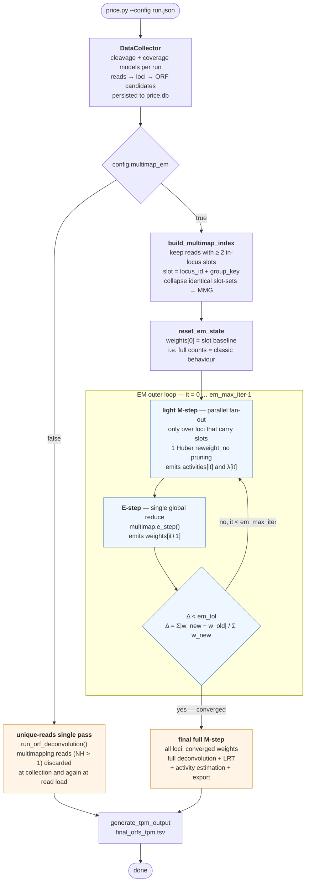
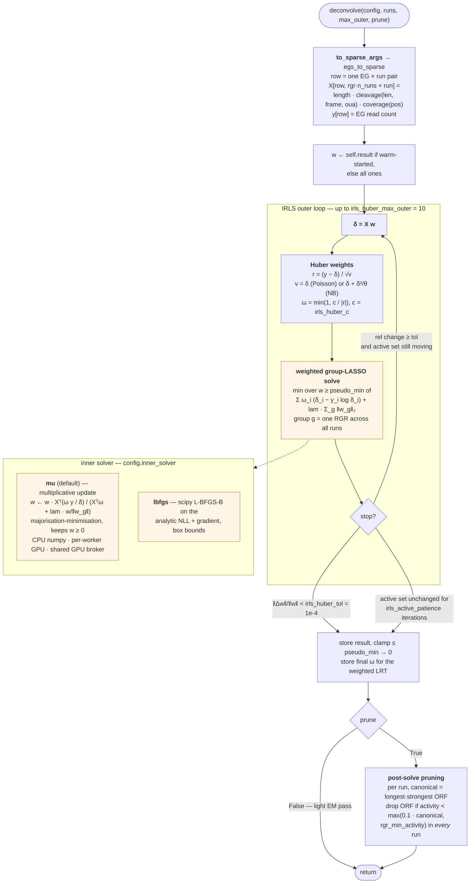
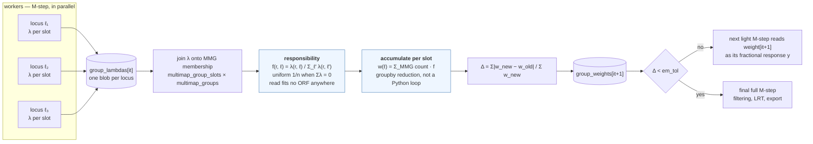
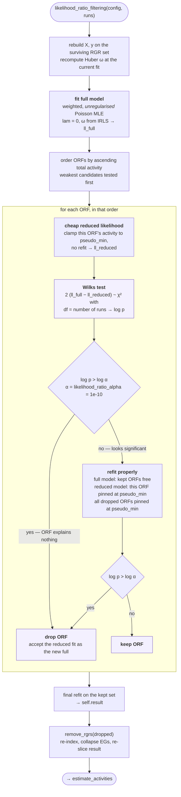

# The PRICE2 deconvolution procedure

Five nested views, from the whole run down to the individual solves.
All node labels name the function that implements the step.

---

## 1. Whole run — the EM outer loop

`price.py :: run_pipeline` / `_run_em_deconvolution`

The **M-step** is the ordinary per-locus deconvolution, unchanged in shape — only its
response vector `y` carries fractional counts. The **E-step** is the only cross-locus
coupling, and it is a per-read normalisation, not a joint optimisation. Loci with no
multimapping slots cannot change between iterations, so the light passes skip them and
they are computed exactly once, in the final pass.

Defaults: `em_max_iter = 30` (backstop), `em_tol = 1e-3` (the normal exit),
`em_huber_steps = 1`.

---

## 2. One locus — the M-step worker

`orf_activity_estimator.py :: process_loc`, running in a `pebble` forkserver worker.

```mermaid
flowchart TD
    IN(["process_loc(locus_id, em_iteration, em_final)"]) --> RUNS["load runs from price.db"]
    RUNS --> CACHE{"EM mode and<br/>prepared_loci cache hit"}

    CACHE -->|"hit"| READS2["get_reads_from_db"]

    CACHE -->|"miss / classic"| SKEL["load Locus skeleton"]
    SKEL --> RGR["<b>build_rgrs</b><br/>enumerate ORF candidates on every<br/>transcript + one NOISE RGR per locus"]
    RGR --> READS["get_reads_from_db"]
    READS --> WFR["<b>make_well_fitting_reads</b><br/>per-RGR read counts, unweighted"]
    WFR --> F1["<b>coverage filter</b><br/>drop ORF if max over runs of<br/>well-fitting reads / length ≤ 0.1"]
    F1 --> F2["<b>deconvolution filter</b><br/>group ORFs by stop codon → split into<br/>splice-compatible optimisation groups →<br/>nested Poisson solve per run →<br/>drop ORF if activity &lt; 0.1 in every run"]
    F2 --> EGS["<b>make_equivalence_groups</b><br/>reads sharing one ORF-compatibility set,<br/>read length and 5' untemplated-addition<br/>state collapse into one EG = one matrix row"]
    EGS --> SAVE["save_prepared_locus<br/>only at EM iteration 0"]
    SAVE --> READS2

    READS2 --> WARM{"EM mode"}
    WARM -->|"yes"| WS["<b>set_warm_start</b> — only when it &gt; 0<br/>activities[it-1], keyed by rgr.id<br/><br/><b>load_locus_mm_data</b><br/>per-slot base and weight[it]"]
    WARM -->|"no — classic"| ASSIGN
    WS --> ASSIGN["<b>assign_reads_to_egs</b><br/>y_EG = Σ read counts<br/>multimapper contributes<br/>max(0, c − base) + weight"]

    ASSIGN --> LIGHT{"em_final"}

    LIGHT -->|"false — light pass"| DL["<b>deconvolve</b><br/>max_outer = em_huber_steps = 1<br/>prune = False"]
    DL --> LAM["<b>compute_multimap_lambdas</b><br/>λ per slot = δ_EG / length_EG"]
    LAM --> WRITE["write_locus_em_output<br/>activities[it] + λ[it] → price.db"]
    WRITE --> STOP(["return — E-step consumes λ"])

    LIGHT -->|"true — classic or final pass"| DF["<b>deconvolve</b> (see §3)<br/>full IRLS-Huber group-LASSO<br/>+ post-solve pruning"]
    DF --> LRT["<b>likelihood_ratio_filtering</b> (see §5)"]
    LRT --> EST["<b>estimate_activities</b><br/>unregularised Poisson MLE,<br/>iteratively drop ORFs below<br/>rgr_min_activity until stable"]
    EST --> EXP["export TSV / GTF / BED<br/>+ processed_loci.txt bookkeeping"]
    EXP --> OUT(["return"])

    classDef filt fill:#f3f0ff,stroke:#7a5cc4
    classDef solve fill:#fff4e6,stroke:#c98a2b
    class F1,F2,LRT filt
    class DL,DF,EST solve
```

Everything above `assign_reads_to_egs` depends only on **unweighted** reads, so it is
identical in every EM iteration. That is exactly the state cached in `prepared_loci`
and reused from iteration 1 onward — ORF generation, both filters and the EG DAG build
are the dominant per-locus cost.

---

## 3. The main deconvolution — IRLS with Huber weights

`locus.py :: deconvolve`

Two stopping criteria run in parallel. The relative-change metric keeps shrinking
geometrically long after the biologically meaningful quantity — the *set* of ORFs above
the activity threshold — has stabilised, so `irls_stop_on_active_set` (default `True`)
exits once that set is unchanged for `irls_active_patience` consecutive iterations.

The group-LASSO penalty is what couples the runs: an ORF is either on or off across the
whole dataset panel, and only its magnitude varies per run.

---

## 4. The E-step — fractional reassignment of multimapping reads

`multimap.py :: e_step`, one global reduce between M-step fan-outs.

`λ(r, ℓ)` is the read's *origin rate* at locus ℓ under the current model: its
design-matrix row without the geometric length factor, dotted with the current
activities — `Σ cleavage · coverage · activity` over the read's compatible ORFs, which is
exactly `δ_EG / length_EG`.

Reads that share the same set of alignment slots behave identically here, so they are
collapsed into **multimap groups** (MMGs) once, at index-build time. Iteration 0 starts
from `weight = base`, i.e. the classic full double-count, which is why the first Δ is
large — it measures the one-off removal of that double count rather than a real move.

---

## 5. Likelihood-ratio filtering

`locus.py :: likelihood_ratio_filtering`, run only on the final pass.

The two-tier test is a cost optimisation, not a statistical one: the clamp-and-score pass
is a couple of sparse mat-vecs, and it settles the large majority of candidates. Only
when the cheap test says *significant* does the expensive pair of constrained refits run
to confirm it — the clamped likelihood is a lower bound on the properly refit reduced
likelihood, so a cheap "not significant" verdict can never be overturned by a refit.

The Huber weights ω are carried over from the deconvolution, so an EG that was an outlier
under the robust fit also contributes less to the test statistic. NOISE RGRs are never
tested and never dropped — they are the null sink that absorbs reads no ORF explains.

---

## Notation

| symbol | meaning |
|---|---|
| `w` | activity vector, one entry per (RGR, run) pair |
| `X` | sparse design matrix, rows = (EG, run), `X[i,j] = length · cleavage · coverage` |
| `y` | observed EG read counts — *fractional* for multimappers under EM |
| `δ = X w` | fitted per-EG expected read count |
| `ω` | Huber weight on the Pearson residual of an EG |
| `λ(r, ℓ)` | origin rate of multimap read `r` at locus `ℓ` = `δ_EG / length_EG` |
| `f(r, ℓ)` | responsibility — `r`'s fractional weight at `ℓ`, sums to 1 over loci |
| `lam` | group-LASSO penalty strength, `config.lam` |
| `θ` | negative-binomial dispersion, `None` for the Poisson model |
